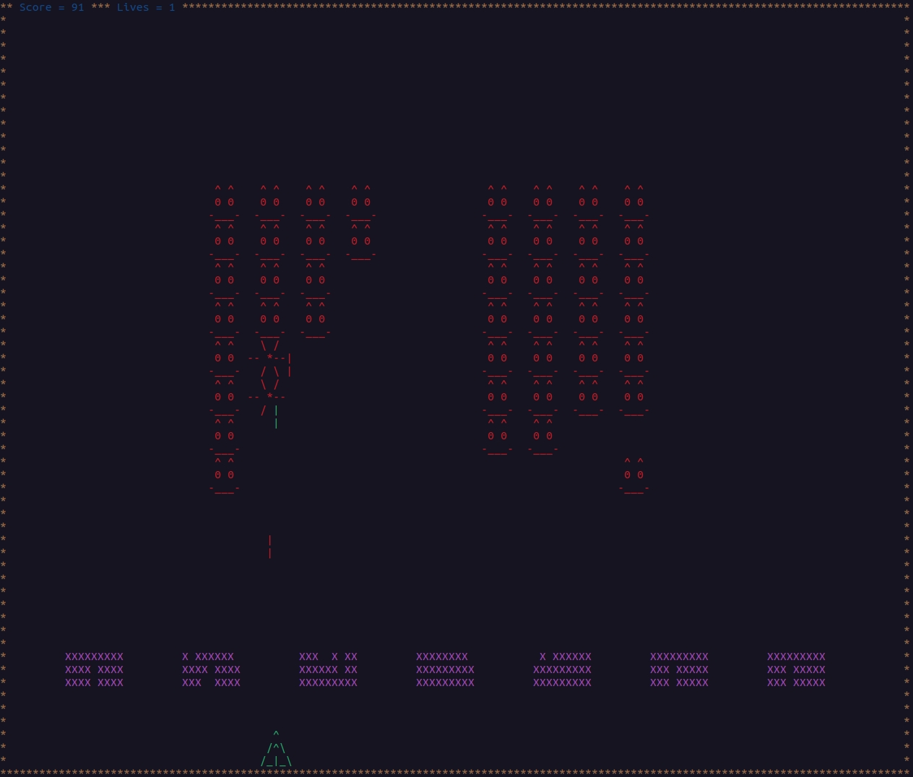

# Space Invaders

This is my first attempt at a full game. It is written in C and uses the Curses library.

Space Invaders was one of those games I got to play on a friends Atari 2600 as a kid. 
I still remember the first time playing it.
I enjoyed making this game and my kids have enjoyed testing it for me.



## Getting Started

The game comes with a makefile. Simply type make when in the directory and it will compile.

## Prerequisites

You will need to have the Curses library. The below command will install it if you don't already have it.

```
sudo apt-get install libncurses5-dev libncursesw5-dev
```

## Author

* **hatchet-elf** 
https://github.com/hatchet-elf/spaceinvaders


## License

This project is licensed under the MIT License - see the [LICENSE] file for details


